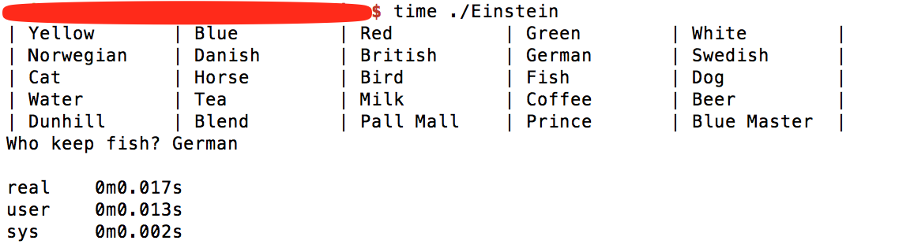

# algorithm
algorithm practice

## Einstein puzzle

### Einstein pullze detail description

+ [einsteins-puzzle](https://csl.name/post/einsteins-puzzle/)
+ [einsteins-puzzle in chinese](https://www.douban.com/note/472913247/)

### compile and run
`g++ -std=c++11 Einstein.cpp -o Einstein && ./Einstein`

### result
# 
| Yellow       | Blue         | Red          | Green        | White        | 
| Norwegian    | Danish       | British      | German       | Swedish      | 
| Cat          | Horse        | Bird         | Fish         | Dog          | 
| Water        | Tea          | Milk         | Coffee       | Beer         | 
| Dunhill      | Blend        | Pall Mall    | Prince       | Blue Master  | 
Who keep fish? German

real	0m0.017s
user	0m0.013s
sys	0m0.002s
